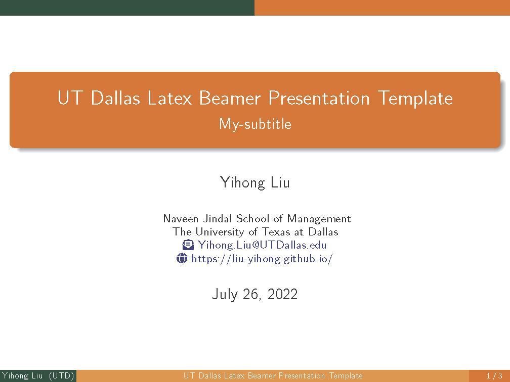

# UTDallas LaTex Beamer Template
 This repository contains an unofficial LaTex beamer template for the University of Texas at Dallas (UT Dallas).
 It follows UT Dallas [color palette](https://brand.utdallas.edu/graphics-visual-identity/color-palette/) from the University's [brand standards](https://brand.utdallas.edu/).
 
 Rendered slides can be previewed at [here](main.pdf)
 
 ## Cover Page Preview
 
 

## License

This LaTex beamer template is released under the [GNU GPL v3.0 License](https://www.gnu.org/licenses/gpl-3.0.en.html).

### About Institutional Marks

This template can display UT Dallas institutional marks at the cover page or every slide. To enable this function, users must consult [the University](https://brand.utdallas.edu/graphics-visual-identity/institutional-marks/) and download the marks into the folder [includes/pics](includes/pics). Then users can activate the mark display by commenting out the scripts in the [logo.tex](includes/tex/logo.tex) file (found in [includes/tex](includes/tex)).

The University of Texas at Dallas logos are for non-commercial and internal University use. Any use of these logos for sponsorships, partnerships or commercial purposes requires approval by the Office of Communications and proof of contractual agreement to use the University marks before being produced. 

Please review the [Promotional Items page](https://utdallas.edu/brand/promotional-items/) for information on producing trademarked materials prior to downloading artwork. Non-University requests for use of University logos, trademarks and word marks should be directed to the Office of Communications at [972-883-4701](tel:972-883-4701) or [marketing@utdallas.edu](mailto:marketing@utdallas.edu).
